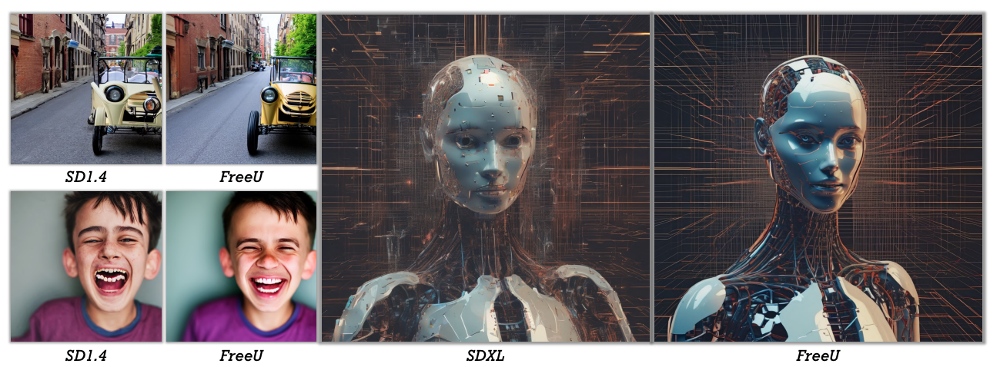

# FreeU: Free Lunch in Diffusion U-Net
This repository is the final assignment for the course "映像メディア学" one of the classes in the Graduate School of Information Science and Technology at the University of Tokyo. Please note that this is not the official implementation of FreeU.

## Paper 
FreeU: Free Lunch in Diffusion U-Net [Si+, CVPR2024], URL: https://arxiv.org/abs/2309.11497

## Explanation of This Paper
This paper presents a method to improve the generation performance of Diffusion Models with very simple modifications, without requiring additional training or parameters.

    

This paper begins with an analysis. It investigates the main contributions of the U-Net architecture to the denoising process and identifies that while its main backbone contributes primarily to denoising, its skip connections mainly introduce high-frequency features to the decoder module, causing the network to overlook the semantics of the backbone. Based on this finding, they propose a simple yet effective method called "FreeU."

FreeU strategically reweights the contributions from the U-Net's skip connections and backbone feature maps, leveraging the strengths of both components of the U-Net architecture. All that is required is to adjust two scaling factors during inference. FreeU can be easily integrated into existing diffusion models, such as Stable Diffusion, DreamBooth, ModelScope, Rerender, and ReVersion.

## Why this paper is important (what the technical core is, why the paper is accepted)
### Technical core
This paper significantly improves performance by introducing only two scaling parameters without additional training or parameters. This simplicity allows for easy integration into many Diffusion Models, potentially leading to fundamental performance improvements in future generative research methods.

Furthermore, before proposing this simple method, they conducted an analysis of the quality of generated images based on the magnitude of frequencies at each step. This proposal is based on such deep insights, making it highly reliable.

### why the paper is accepted
I believe there are two reasons why this paper was accepted.

Firstly, the high reliability of the method. In this paper, extensive preliminary experiments were conducted before proposing the method. The method is highly reliable because it is proposed based on the insights gained from these preliminary experiments.

Secondly, the high scalability due to the simplicity of the method. The fact that this method can be easily integrated into many Diffusion Models is expected to lead to fundamental performance improvements in future generative research methods.

### What you have implemented

